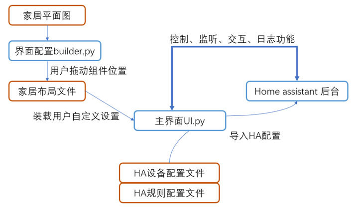
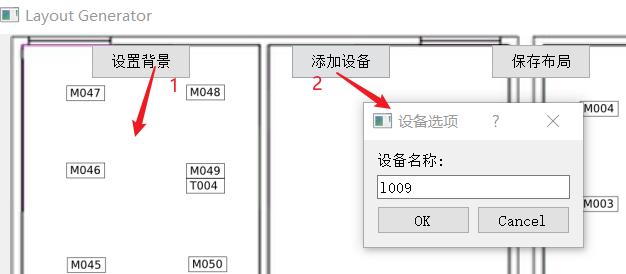
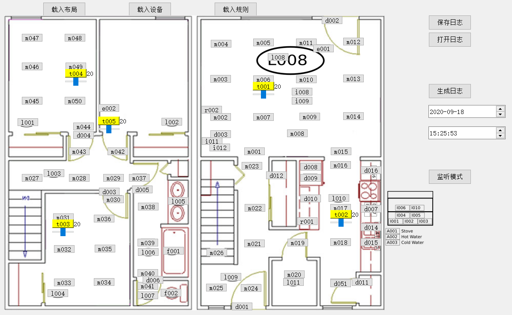
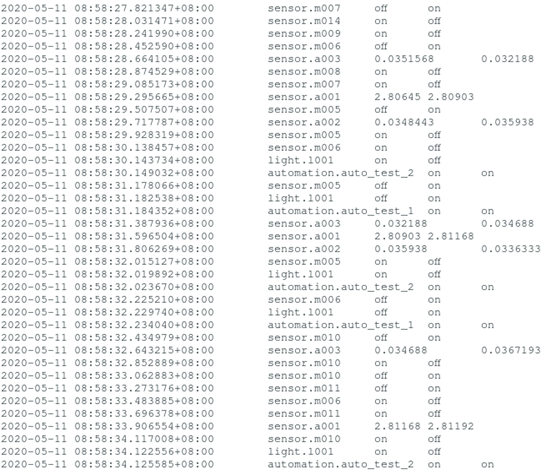
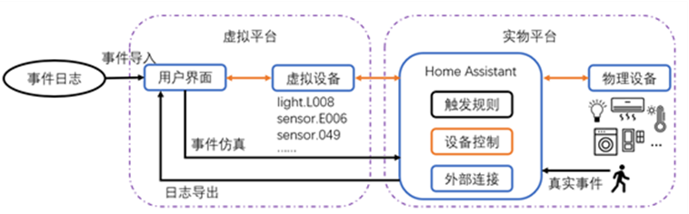

# SmartHomeUI

A GUI for showing the data from Home Assistant and controlling virtual devices or sending event log. 

* Use builder.py to generate the layout file.

  

* Run UI.py to show the window.Please load home layout file (e.g. position.txt) first, then you can see the devices.

* Tested based on Home Assistant (version: 0.103.4)

* 监听功能需要在 core.py 的575行处添加发送状态的程序

* Log file example:

# Virtual Reality Platform

